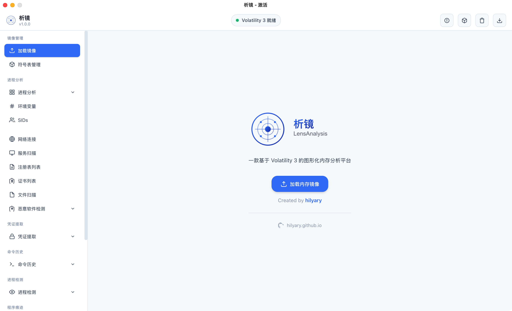
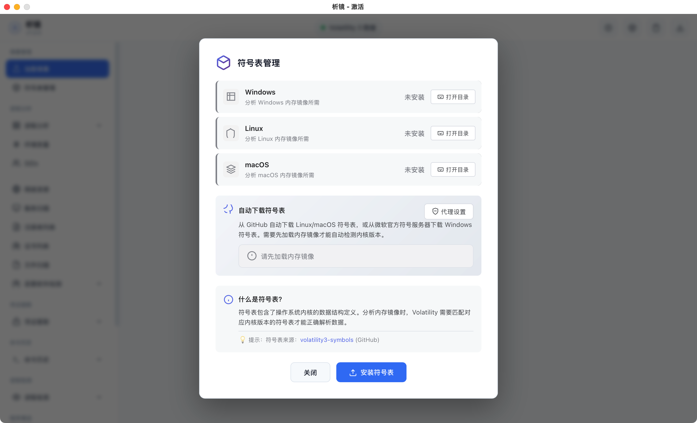
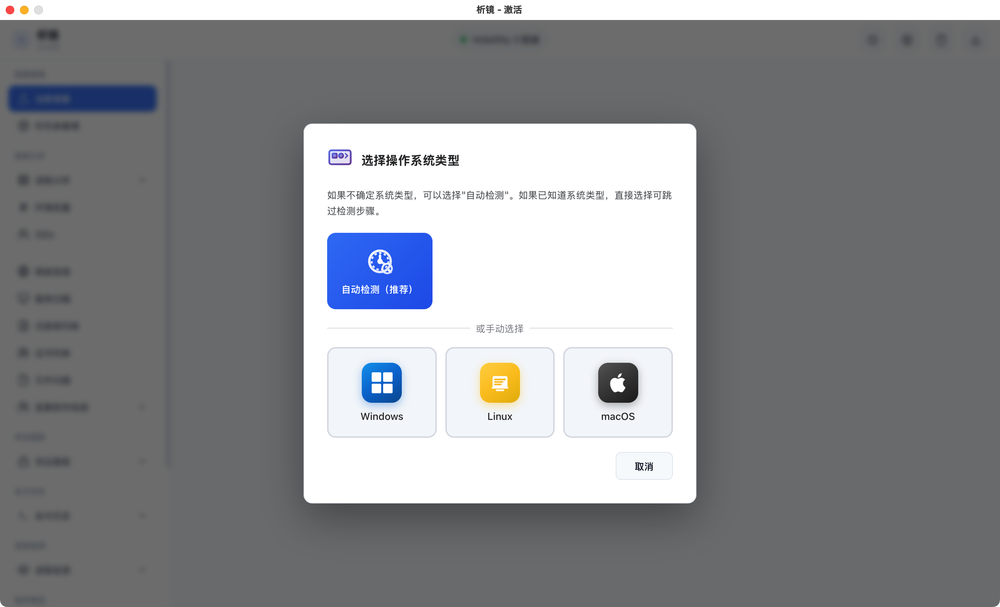
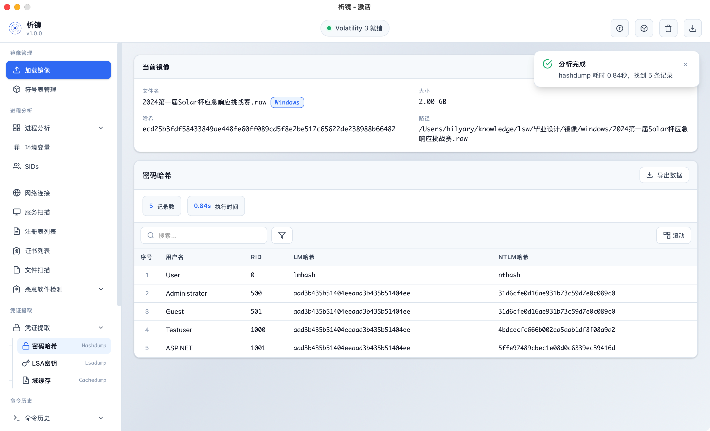
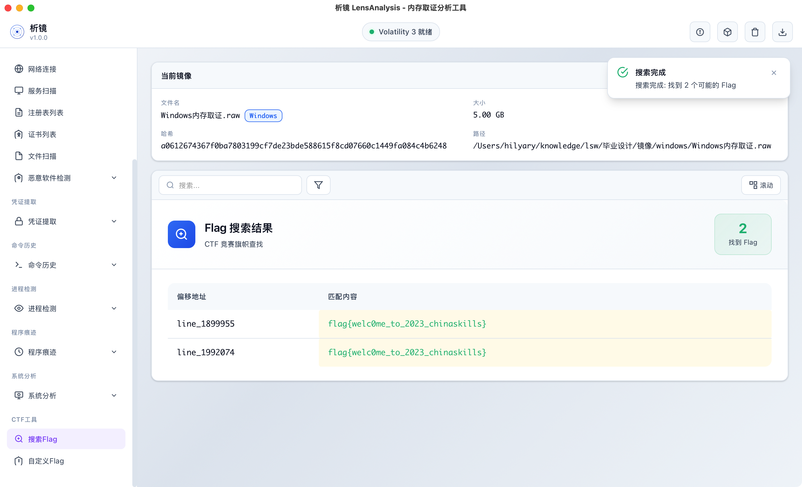

# 析镜 LensAnalysis

专业的内存取证分析工具，基于 Volatility 3 框架开发，为安全研究人员、CTF 爱好者和应急响应人员提供强大的内存镜像分析能力。

## 📢 开源公告

> **2026 年 9 月 15 日，值此 2026 年国家网络安全宣传周期间，析镜 LensAnalysis 正式开放源代码。**

[2026 年国家网络安全宣传周](https://www.cac.gov.cn/2026-09/01/c_1790011556066214.htm)于 9 月 14 日至 20 日开展，主题为“网络安全为人民，网络安全靠人民——智能时代 网安护航”。析镜希望以开放协作的方式，让内存取证能力更易获取，也欢迎更多安全研究人员和开发者参与改进。

- 欢迎将本项目用于个人学习、安全研究、CTF 竞赛、教学和其他非商业用途
- 允许在保留原作者及版权信息的前提下进行修改、分发和二次开发
- 未经原作者书面授权，不得销售本软件或其修改版本，不得将其集成到商业产品、用于收费服务或其他商业获利活动
- 如需商业使用，请提前与原作者沟通并取得授权

具体许可条件请阅读 [LICENSE](LICENSE)。

## ✨ 功能特性

### 🖥️ 跨平台支持

- **Windows** - 原生支持，提供 `.exe` 可执行文件（由于是py打包，没签名会误报有毒）
- **macOS** - 提供 `.dmg` 安装包
- **Linux** - 提供 `.tar.gz` 构建包，也支持通过源码运行

### 🔍 强大的分析能力

#### Windows 内存镜像

- **进程分析** - pslist, pstree, psscan, dlllist, handles, cmdline
- **网络分析** - netscan, netstat（含完整时间戳）
- **注册表** - hivelist, printkey, certificates, userassist
- **恶意代码** - malfind, ldrmodules, hollowprocesses
- **密码提取** - hashdump, lsadump, cachedump
- **服务扫描** - svcscan, svclist
- **更多插件** - 60+ Windows 分析插件

#### Linux 内存镜像

- **进程分析** - pslist, pstree, psaux, envars
- **网络分析** - netstat, sockstat, ip_addr, ip_link
- **内核模块** - lsmod, check_modules, check_syscall
- **Bash 历史** - bash 命令历史提取
- **文件系统** - lsof, list_files, mount_info
- **恶意代码** - malfind, check_idt, check_afinfo

#### macOS 内存镜像

- **进程分析** - pslist, pstree, psaux, envars
- **网络分析** - netstat, ifconfig
- **内核扩展** - lsmod
- **文件系统** - lsof, list_files, mount
- **系统信息** - timers, kauth_listeners, vfsevents

### 🎯 CTF 专用功能

- **Flag 搜索** - 自动搜索常见 Flag 格式（flag{xxx}）
- **正则搜索** - 自定义正则表达式搜索内存
- **字符串提取** - 提取所有可打印字符串

### 🚀 性能优化

- **智能缓存** - 分析结果自动缓存，重复操作秒级响应
- **符号表管理** - 自动下载和管理系统符号表
- **代理支持** - 支持 HTTP/HTTPS/SOCKS5 代理

### 🛠️ 特色功能

- **Linux 符号表自动制作** - 从官方源自动下载 dbgsym 调试符号包并转换为 Volatility 3 所需的 ISF 格式符号表。支持 Ubuntu、Debian、CentOS 等发行版，无需手动寻找和制作符号表。

### 📊 报告导出

- **Markdown** - 生成 Markdown 格式报告
- **HTML** - 生成网页格式报告
- **Word** - 生成 Word 文档报告

## 🖼️ 界面预览

### 镜像主界面

### 符号表管理

### 加载镜像

### 插件执行结果

### Flag搜索

## 📦 下载安装

请前往 [GitHub Releases](https://github.com/hilyary/LensAnalysis/releases) 下载最新版本。析镜现已开源，**无需机器码或激活码**。

### Windows

1. 下载最新版 `LensAnalysis.exe`
2. 双击运行即可
3. 首次启动阅读并同意使用条款，在欢迎页输入个人 ID 后进入析镜

> Windows 安装包由 Python 打包且暂未进行代码签名，部分安全软件可能产生误报，请从本项目官方 Releases 下载。

### macOS

1. 下载最新版 `LensAnalysis-*-macOS.dmg`
2. 打开 DMG 文件
3. 将 `LensAnalysis.app` 拖到 Applications 文件夹
4. 打开应用（首次运行需要右键→打开）

### Linux

1. 下载最新版 `LensAnalysis-linux.tar.gz`
2. 解压后运行目录中的 `run.sh`

## 🎮 快速上手

1. **启动应用**
   - Windows: 双击 `LensAnalysis.exe`
   - macOS: 启动台打开 `LensAnalysis`

2. **加载镜像**
   - 点击 "加载镜像" 按钮
   - 选择内存镜像文件（`.raw`、`.mem`、`.vmem` 等）
   - 选择操作系统类型（可选，系统会自动检测）

3. **执行分析**
   - 左侧面板选择分析插件
   - 点击即可执行分析
   - 结果实时显示在右侧面板

4. **导出报告**
   - 点击 "导出报告" 按钮
   - 选择报告格式（Markdown/HTML/Word）
   - 报告自动生成并保存

## 🔧 系统要求

| 平台    | 最低要求                    |
| ------- | --------------------------- |
| Windows | Windows 10/11 (64位)        |
| macOS   | macOS 12+ (Monterey 或更高) |
| Linux   | 主流 64 位 Linux 发行版     |

## ⚖️ 许可协议

**本项目已于 2026 年 9 月 15 日正式开放源代码。允许非商业使用和二次开发；商业使用须事先与原作者沟通并取得书面授权。**

### ✅ 允许的用途

- 个人学习、研究和安全测试
- CTF 竞赛等安全竞赛活动
- 授权的渗透测试和应急响应
- 教育机构和学术研究
- 在保留原作者及版权信息的前提下修改、分发和进行非商业二次开发

### ❌ 禁止的行为

- 未经授权的商业使用
- 未经授权销售软件、提供收费服务或集成到商业产品
- 移除或修改软件版权信息
- 将修改版本冒充原作者官方版本
- 利用软件进行任何违法违规活动

### 📧 商业授权

如需商业使用，请先通过下方联系方式与原作者沟通并取得书面授权。完整条款以 [LICENSE](LICENSE) 为准。

## 🛡️ 免责声明

本工具仅供安全研究和授权测试使用。用户在使用本工具时应遵守当地法律法规。对于因滥用本工具造成的任何后果，作者不承担责任。

## 🙏 致谢

- [Volatility 3](https://github.com/volatilityfoundation/volatility3) - 强大的内存分析框架

## 📮 联系方式

- **GitHub**: https://github.com/hilyary/LensAnalysis
- **Issues**: https://github.com/hilyary/LensAnalysis/issues

---

**析镜 LensAnalysis** - 让内存取证更简单

*最后更新：2026 年 9 月 15 日*
